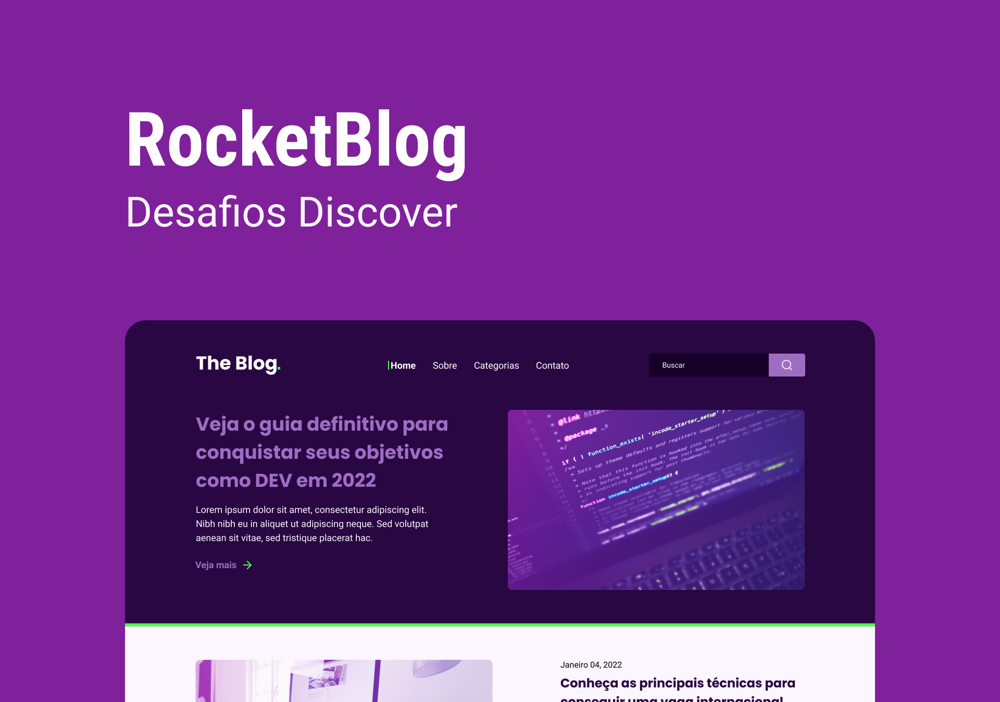

<h1 align="center">
  
</h1>

# ✅ **Requisitos**

---

Neste desafio foi proposto, desenvolver uma homepage para um blog.

**Requisitos para o desafio:**

- Seguir o layout do [Figma](https://www.figma.com/file/r4CsL6MPTAvE7EvJXjhFK4/DD-RocketBlog/duplicate).

**Extras:**

- Tornar a homepage responsiva.
- Colocar efeitos nos links e botões.

# 🎨 Style Guide

---

## **Cores:**

```css
:root {
  --purple-bg: #290742;
  --dark-bg: #170027;
  --button-bg: #9e6dc2;
  --white: #fff;
  --light-purple: #fbf6ff;
  --green: #4fff4b;
}
```

## **Tipo de fonte:**

font-family: Poppins

font-weight: 700

font-family: Roboto

font-weight: 400 e 700

Você pode encontrar a fonte no [Google Fonts](https://fonts.google.com/)
